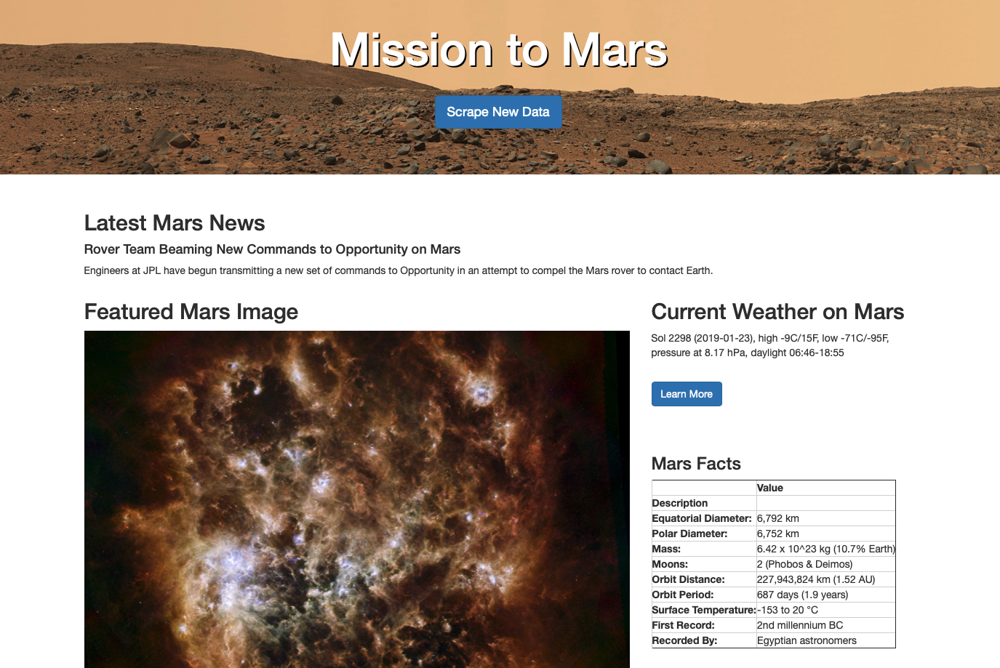

# Mission to Mars


Build a web application that scrapes various websites for data related to the Mission to Mars and displays the information in a single HTML page. The following outlines what you need to do.

## Scraping

### - [Mission to Mars -- Jupyter Notebook](https://nbviewer.jupyter.org/github/Pyligent/mars_scraper/blob/master/mission_to_mars_tj.ipynb)

#### NASA Mars News

* Scrape the [NASA Mars News Site](https://mars.nasa.gov/news/) and collect the latest News Title and Paragraph Text. Assign the text to variables that you can reference later.

```python
# Example:
news_title = "NASA's Next Mars Mission to Investigate Interior of Red Planet"

news_p = "Preparation of NASA's next spacecraft to Mars, InSight, has ramped up this summer, on course for launch next May from Vandenberg Air Force Base in central California -- the first interplanetary launch in history from America's West Coast."
```

#### JPL Mars Space Images - Featured Image

* Visit the url for JPL Featured Space Image [here](https://www.jpl.nasa.gov/spaceimages/?search=&category=Mars).

* Use splinter to navigate the site and find the image url for the current Featured Mars Image and assign the url string to a variable called `featured_image_url`.

```python
# Example:
featured_image_url = 'https://www.jpl.nasa.gov/spaceimages/images/largesize/PIA16225_hires.jpg'
```

#### Mars Weather

* Visit the Mars Weather twitter account [here](https://twitter.com/marswxreport?lang=en) and scrape the latest Mars weather tweet from the page. Save the tweet text for the weather report as a variable called `mars_weather`.

```python
# Example:
mars_weather = 'Sol 1801 (Aug 30, 2017), Sunny, high -21C/-5F, low -80C/-112F, pressure at 8.82 hPa, daylight 06:09-17:55'
```

#### Mars Facts

* Visit the Mars Facts webpage [here](http://space-facts.com/mars/) and use Pandas to scrape the table containing facts about the planet including Diameter, Mass, etc.

* Use Pandas to convert the data to a HTML table string.

#### Mars Hemispheres

* Visit the USGS Astrogeology site [here](https://astrogeology.usgs.gov/search/results?q=hemisphere+enhanced&k1=target&v1=Mars) to obtain high resolution images for each of Mar's hemispheres.


```python
# Example:
hemisphere_image_urls = [
    {"title": "Valles Marineris Hemisphere", "img_url": "..."},
    {"title": "Cerberus Hemisphere", "img_url": "..."},
    {"title": "Schiaparelli Hemisphere", "img_url": "..."},
    {"title": "Syrtis Major Hemisphere", "img_url": "..."},
]
```

- - -

## MongoDB and Flask Application

### - [scraper_mars.py](https://github.com/Pyligent/mars_scraper/blob/master/scrape_mars.py)   
### - [app.py - Flask app](https://github.com/Pyligent/mars_scraper/blob/master/app.py)   
### - [Website HTML file](https://github.com/Pyligent/mars_scraper/blob/master/templates/index.html)   

Use MongoDB with Flask templating to create a new HTML page that displays all of the information that was scraped from the URLs above.

   
<br>


- - -

